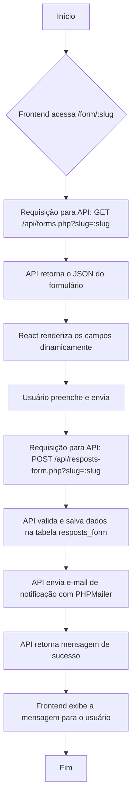

# Formulário Dinâmico com React + API (MVP)

---

## Descrição do Projeto

Este projeto é um sistema de formulários dinâmicos. Uma API em PHP fornece a estrutura de cada formulário em formato JSON. O frontend em React renderiza o formulário com base nesse JSON. As submissões dos usuários são salvas em um banco de dados MySQL e enviadas para um e-mail cadastrado.

O foco desta versão é ser um **Produto Mínimo Viável (MVP)**, priorizando a simplicidade e a rapidez na implementação do fluxo principal.

---

## Tecnologias Utilizadas

- **Frontend**: React + Vite, React Hook Form, React Router DOM, Tailwind CSS

- **Backend**: PHP (sem framework, para compatibilidade com hospedagens compartilhadas + biblioteca PHPMailer + bibliote PhpSpreadsheet se preferir os arquivos em Excel .xlsx)

- **Banco de Dados**: MySQL

---

## Estrutura do Banco de Dados (MySQL)

Para o sistema funcionar, são necessárias duas tabelas: uma para armazenar a estrutura dos formulários e outra para as submissões.

### 1. Tabela `forms`

- Armazena a definição JSON de cada formulário.

### 2. Tabela `resposts_form`

Armazena os dados enviados pelos usuários.

---

## Gerenciamento de Formulários (MVP)

Para esta versão inicial, não haverá painel administrativo. Os formulários serão criados inserindo o JSON de sua estrutura diretamente na tabela `forms` do banco de dados (por exemplo, usando o phpMyAdmin ou postman).

---

## API Endpoints (Backend - PHP)

A comunicação entre o frontend e o backend será feita através de dois endpoints simples.

### 1. Buscar Estrutura do Formulário

- **Endpoint**: `GET /api/forms.php?slug=:slug`
- **Ação**: Retorna a estrutura JSON de um formulário específico que esteja com `published = true`.

<!-- - **Resposta de Sucesso (200 OK)**: O conteúdo da coluna form_json.
- **Resposta de Erro (404 Not Found)**: Se o formulário não for encontrado ou não estiver publicado. -->

### 2. Salvar Submissão

- **Endpoint exemplo**: `POST /api/resposts-form.php?slug=:slug`

- **Ação**: Recebe os dados preenchidos do formulário e salva na tabela `resposts_form`.

- **Corpo da Requisição**: Um objeto JSON com os dados do formulário (`{ "nome": "...", "email": "..." }`).

<!-- - **Resposta de Sucesso (201 Created)**: `{ "message": "Submissão salva com sucesso!" }`

- **Resposta de Erro (400 Bad Request / 404 Not Found)**: Se os dados forem inválidos ou o formulário não existir. -->

---

## Notificação por E-mail (com PHPMailer)

Para garantir que cada submissão seja notificada de forma confiável e profissional, o sistema utilizará a biblioteca **PHPMailer** para enviar e-mails.

### Por que PHPMailer?

Em vez de usar a função `mail()` nativa do PHP, que frequentemente resulta em e-mails caindo na caixa de spam, o PHPMailer envia e-mails através de um servidor SMTP autenticado. Isso aumenta drasticamente a taxa de entrega e a confiabilidade.

### Funcionalidade

**1. Gatilho**: Após uma submissão ser salva com sucesso no banco de dados (`POST /api/resposts-form.php`).
<br>

**2. Ação**: Um e-mail em formato HTML é enviado para um ou mais administradores.
<br>

**3. Conteúdo do E-mail**:

    - O título do formulário que foi preenchido.

    - Uma tabela formatada com todos os dados enviados pelo usuário.

    - Um link para download de um arquivo CSV ou Excel .xlsx contendo os dados daquela submissão específica.

---

## Lógica do Fluxo



---

## Exemplos de Estruturas JSON

> **Formulários com layout padrão e outro específico para cotação**.

### Estrutura JSON - Layout Padrão

```json
{
  "formId": "cadastro_usuario",
  "theme": "card-default",
  "title": "Cadastro de Usuário",
  "description": "Formulário para novos usuários",
  "published": true,
  "slug": "a8dcf31a426a8b79",
  "components": [
    {
      "type": "textfield",
      "key": "nome",
      "label": "Nome",
      "input": true,
      "validations": {
        "required": true,
        "minLength": 3,
        "errorMessage": {
          "required": "O nome é obrigatório.",
          "minLength": "O nome deve ter pelo menos 3 caracteres."
        }
      }
    },
    {
      "type": "email",
      "key": "email",
      "label": "E-mail",
      "input": true,
      "validations": {
        "required": true,
        "errorMessage": {
          "required": "O e-mail é obrigatório."
        }
      }
    },
    {
      "type": "textfield",
      "key": "cpf_cnpj",
      "label": "CPF ou CNPJ",
      "placeholder": "Digite apenas números",
      "input": true,
      "validations": {
        "required": true,
        "pattern": "^\\d{11}(\\d{3})?$",
        "errorMessage": {
          "required": "O CPF ou CNPJ é obrigatório.",
          "pattern": "Informe um CPF (11 dígitos) ou CNPJ (14 dígitos), apenas números."
        }
      }
    },
    {
      "type": "select",
      "key": "estado",
      "label": "Estado",
      "placeholder": "Selecione seu estado",
      "input": true,
      "validations": {
        "required": true,
        "errorMessage": {
          "required": "Selecione um estado."
        }
      },
      "options": [
        { "label": "SP", "value": "SP" },
        { "label": "RJ", "value": "RJ" }
      ]
    },
    {
      "type": "group",
      "key": "enderecos",
      "label": "Endereços",
      "repeatable": true,
      "components": [
        {
          "type": "textfield",
          "key": "rua",
          "label": "Rua",
          "validations": {
            "required": true,
            "errorMessage": {
              "required": "A rua é obrigatória."
            }
          }
        },
        {
          "type": "textfield",
          "key": "numero",
          "label": "Número",
          "validations": {
            "required": true,
            "errorMessage": {
              "required": "O número é obrigatório."
            }
          }
        }
      ]
    },
    {
      "type": "button",
      "key": "submit_button",
      "label": "Enviar Cadastro"
    }
  ]
}
```

### Estrutura JSON - Layout para cotação

```json
{
  "formId": "cotacao_materiais_de_construcao",
  "theme": "cotation-v1",
  "title": "Cotação de materiais de construção",
  "description": "Envie o seu orçamento",
  "published": true,
  "slug": "a8dcf31a226a8b79",
  "components": [
    // --- Seção de formulário normal ---
    { "type": "textfield", "key": "loja_nome", "label": "Nome da loja" },
    {
      "type": "email",
      "key": "email",
      "label": "E-mail"
    },
    {
      "type": "number",
      "key": "telefone_contato",
      "label": "Telefone de contato"
    },

    // --- Grupo com estilo para cotação ---
    {
      "type": "group",
      "key": "produtos",
      "label": "Produtos Desejados",
      "repeatable": true,
      "layout": "table",
      "components": [
        {
          "type": "textfield",
          "key": "item_produto",
          "label": "Tijolo",
          "placeholder": "Modelo do tijolo",
          "validations": {
            "required": true,
            "errorMessage": {
              "required": "Preencha o nome do produto."
            }
          }
        },
        {
          "type": "number",
          "key": "item_qtd",
          "label": "Quantidade",
          "validations": {
            "required": true,
            "errorMessage": {
              "required": "Preencha a quantidade."
            }
          }
        },
        {
          "type": "select",
          "key": "unit",
          "label": "Unidade",
          "input": true,
          "validations": {
            "required": true,
            "errorMessage": {
              "required": "Selecione uma unidade de medida."
            }
          },
          "options": [
            { "label": "m²", "value": "m²" },
            { "label": "unidade", "value": "unidade" }
          ]
        },
        {
          "type": "number",
          "key": "value",
          "label": "Valor",
          "validations": {
            "required": true,
            "errorMessage": {
              "required": "Preencha o valor."
            }
          }
        }
      ]
    },
    { "type": "button", "label": "Enviar Orçamento" }
  ]
}
```

---

## Tipos de Campo (Componentes)

O sistema de formulários suporta os seguintes tipos de componentes:

- `textfield`: campo de texto simples.
- `email`: campo para e-mails.
- `number`: campo numérico.
- `textarea`: texto longo.
- `select`: lista de opções.
- `radio`: lista de botões para seleção única.
- `checkbox`: seleção única ou múltipla.
- `date`: seletor de data.

> [!IMPORTANT]
>
> - `group`: grupo de campos, com suporte a repetição e mudança de layout.
>   - `repeatable`: se for `true`, vai aparecer um botão onde será possível adicionar um novo campo igual.
>   - `layout`: caso o valor seja por exemplo `"table"`, o layout do grupo vai mudar para o de uma tabela.

- `file`: Para upload de arquivos, um requisito muito comum.
- `section`: separador visual, sem entrada de dados.
- `button`: botão de ação (ex: enviar).

---

### Propriedades importantes

- `formId`: id do formulário, deve ser único.
- `theme`: Define o tema geral do formulário. Por exemplo, se vai ocupar maior parte da tela ou não.
- `title`: Título do formulário.
- `description`: Descrição do formulário.
- `published`: o published define se o formulário vai estar disponível para o usuário ou não | `true` ou `false`.
- `slug`: A slug será um hash aleátorio utilizando bin2hex. Valor único.
- `key`: A key é o identificador único de cada campo dentro de um formulário. Ela é usada para identificar o campo na renderização e para nomear o dado na submissão.
- `label`: Define o que vai aparecer no label de cada campo do formulário.
- `input`: O `input` `true` indica que aquele componente específico é um campo que coleta dados do usuário e que seu valor deve ser incluído no objeto JSON final da submissão.

**_Regras:_**

- **Deve ser única dentro de um mesmo formulário**.

  - **❌ Incorreto**: Ter dois campos com `key: "email"` no mesmo formulário.

  - **✅ Correto**: Usar `key: "email_pessoal"` e `key: "email_trabalho"`.

<br>

- **_Pode ser repetida em formulários diferentes._**

  - **✅ Correto**: Por exemplo o formulário de "Contato" e o de "Cadastro" podem, ambos, ter um campo com `key: "email"`.

---

## Validações Suportadas

As validações são definidas no JSON e aplicadas no frontend. É crucial que todas as validações sejam re-checadas no backend (PHP) antes de salvar no banco de dados.

- `required`: `true` campo obrigatório
- `minLength`: número mínimo de caracteres
- `maxLength`: número máximo de caracteres
- `pattern`: expressão regular (regex) para validações customizadas (CPF, CEP, etc.)

---

### Onde pode ficar hospedado?

- O site vai ficar hospedado na HostGator em um subdomínio. Exemplo form.rgimpressao.com.br.
- Os e-mails vão ficar linkados a esse subdomínio.
